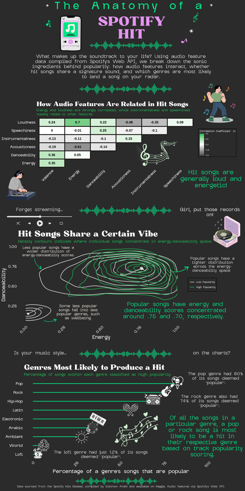

# The Anatomy of a Spotify Hit

Music is an essential part of daily life as it shapes moods, makes memories, and defines cultural moments. As someone who loves karaoke and vocal technique, I have always been personally curious about what makes certain songs resonate so deeply with listeners. With the rise of algorithmic music discovery, the question of what makes a song popular has become a topic of interest. Spotify, the world's largest audio streaming platform with over 751 million users and a catalog spanning 100,000 tracks, 7 million podcasts, and 500,000 audiobooks, sits at the center of this shift ([Spotify Newsroom, n.d.](https://newsroom.spotify.com/company-info/)). Its dominance in the streaming landscape and its influence on charts, like the Billboard Hot 100, makes it a compelling lens through which to visualize modern music popularity.

This project aims to uncover the audio and genre characteristics that distinguish Spotify hits from the rest of the catalog. Drawing on the Spotify Music Dataset compiled by Solomon Ameh and accessed via Kaggle, this infographic explores three core questions:

-   How do audio features relate to one another in popular songs?

-   Do hit songs cluster around certain energy-danceability combinations?

-   Which genres are most likely to produce a popular track?

Together, these visualizations aim to reveal whether there is a discernible recipe behind a Spotify hit, drawing on publicly available data from the Spotify Music Dataset compiled by Solomon Ameh and accessed via Kaggle.

## About The Data

The visualizations in this infographic draw on the [Spotify Music Dataset](https://www.kaggle.com/datasets/solomonameh/spotify-music-dataset) compiled by Solomon Ameh, accessed via Kaggle. Popularity in this dataset is defined using Spotify's track popularity metric, a score calculated by the Spotify Web API based on total streams and recency of plays. The dataset is split into two files: a low-popularity subset (track popularity scores of 11-68) and a high-popularity subset (scores of 68–100). For this analysis, a score of 68 was used as the threshold separating hit songs from the rest, approximately the 75th percentile of all track popularity scores in the combined dataset.

\[will include list of variables considered and meaning\]

## Final Infographic\* 

The finalized infographic is included here. The construction of each graph is included in individual code chunks below and can be referenced in needed.

*\*Note: I am in the process of updating the icons derived from Canvas to be included in my final lollipop plot. Additionally, I will add my annotations with the correct placement.*



## Import and Wrangle

Here, the necessary packages are loaded, and each of the datasets (`low_popular` and `high_popular`) are read in and combine (`spotify_clean`).

```{r}
#| message: false
library(tidyverse)
library(ggthemes)
```

```{r}
# Import most popular songs
high_popular <- read.csv(
  here::here("data", "high_popularity_spotify_data.csv"))

# Import less popular songs
low_popular <- read.csv(
  here::here("data", "low_popularity_spotify_data.csv"))
```

```{r}
# Combine both low and high popular datasets
spotify_clean <- bind_rows(low_popular, high_popular)
```

To verify the popularity threshold, the distribution of track popularity scores was visualized across both groups. The histogram reveals a bimodal distribution, with a natural separation between low and high popularity songs around a score of 68; this is approximately the 75th percentile of all scores in the combined dataset. This cutoff was adopted directly from the original dataset author's classification, as outlined in the distribution.

```{r}
# Popularity cutoff based on bimodal distribution
spotify_clean %>%  mutate(popularity_group = factor(
    ifelse(track_popularity > 68, "high", "low"),
    levels = c("low", "high")
  )) %>%
  ggplot(aes(x = track_popularity, 
             fill = popularity_group)) +
  geom_histogram(binwidth = 2, color = "white", linewidth = 0.1) +
  geom_vline(xintercept = 68, color = "white",
             linewidth = 1, linetype = "dashed") +
  scale_fill_manual(values = c("low" = "#535353", 
                                "high" = "#1DB954"),
                    labels = c("Low Popularity", 
                               "High Popularity")) +
  labs(title = "Distribution of Track Popularity Scores",
       subtitle = "A score of 68 (~75th percentile) separates high and low popularity songs.",
       x = "Track Popularity", y = "Count", fill = NULL) +
  theme_minimal()
```

The two datasets were merged and filtered to retain only the audio features relevant to this analysis, including acousticness, valence, energy, danceability, loudness, tempo, speechiness, instrumentalness, and liveness. Duplicate tracks and incomplete records were removed. Songs with a track popularity score above 68 were labeled as high popularity, and all others as low popularity.

```{r}
# Select variables relevant to the analysis
spotify_clean <- spotify_clean %>%
  select(track_id, track_name,
         playlist_genre, acousticness,
         track_popularity,
         valence, energy, danceability, mode, loudness, tempo, speechiness, instrumentalness, liveness) %>%
  distinct() %>%
  drop_na() %>%
  mutate(popularity_group = factor(
    ifelse(track_popularity > 68, "high", "low"),
    levels = c("low", "high")
  ))
```

Since the low-popularity dataset was considerably larger than the high-popularity dataset, a random sample of low-popularity songs equal in size to the high-popularity group (n = 1,686) was drawn to create a balanced dataset. This ensures that any observed differences between the two groups reflect genuine patterns rather than an imbalance in sample size.

```{r}
# For reproducibility
set.seed(123)

n <- nrow(high_popular) # 1686

# Set sliced random sample to same # of obs in less popular songs
low_sample <- low_popular %>% slice_sample(n = n)

# Assign low sample to replace low_popular
spotify_clean <- bind_rows(
  high_popular %>% mutate(popularity_group = "high"),
  low_sample   %>% mutate(popularity_group = "low")
) %>%
  select(track_id, track_name,
         playlist_genre, acousticness,
         track_popularity,
         valence, energy, danceability, mode, loudness, tempo, speechiness, instrumentalness, liveness)  %>%
  distinct() %>%
  drop_na() %>% 
   mutate(popularity_group = factor(
    ifelse(track_popularity > 68, "high", "low"),
    levels = c("low", "high")
  ))

# Verify balance
table(spotify_clean$popularity_group)
```

## Visualization Construction

The following visualizations explore three dimensions of Spotify hits: how audio features relate to one another, whether hit songs cluster around specific energy-danceability combinations, and which genres are most likely to produce a popular track. Each question has an associated code chunk that contains code relevant to the construction of each visualization.

### How do audio features relate in hits?

```{r, fig.width = 10, fig.height = 5}
# Add canva font
library(showtext)

# Load fonts
font_add("Bugaki", "~/MEDS/eds-240/eds240-infographic/fonts/Bugaki.ttf") # Title font
font_add("Glock Grotesk", "~/MEDS/eds-240/eds240-infographic/fonts/GlockGrotesque-Medium.ttf") # Body font

# Inform ggplot to use text families
showtext_auto() 

# Variable labels 
music_labels <- c(
  valence = "Valence",
  energy = "Energy", 
  danceability = "Danceability",
  acousticness = "Acousticness",
  instrumentalness = "Instrumentalness",
  speechiness = "Speechiness",
  loudness = "Loudness"
)

# Establish variable order
var_order <- c("valence", "energy", "danceability",
               "acousticness", "instrumentalness",
               "speechiness", "loudness")
# Plot
spotify_clean %>%
  filter(popularity_group == "high") %>% # Filter for popular songs only
  select(all_of(var_order)) %>% # Select audio features in the var_order character vector
  cor() %>% # Find correlations for each relationship
  round(2) %>% # Round each coefficient to 2 decimal places
  as.data.frame() %>% # Convert correlation matrix to data frame
  rownames_to_column("var1") %>% # Convert rownames to column so audio features are not lost in pivot conversion
  pivot_longer(-var1, names_to = "var2", values_to = "corr") %>% # Each audio feature has duplicate apperance and associated r
  mutate( # Establish audio features as levels
    var1 = factor(var1, levels = var_order),
    var2 = factor(var2, levels = var_order)
  ) %>% 
  filter(as.numeric(var1) > as.numeric(var2)) %>% # Exclude diagonal and upper triangle to avoid redundancy
  
  # Plot
  ggplot(aes(x = var2, y = var1, fill = corr)) +
  geom_tile(color = "#191414", linewidth = 1.5) +
  geom_text(aes(label = corr), size = 7, 
            color = "black", fontface = "bold") +
  scale_fill_gradient2(
    low = "#535353", mid = "white", high = "#1DB954",
    midpoint = 0, limits = c(-1, 1)
  ) +
  scale_x_discrete(labels = music_labels) +
  scale_y_discrete(labels = music_labels) +
  labs(
    title = "How Audio Features Are Related in Hit Songs",
    subtitle = "Energy and loudness are strongly correlated, while instrumentalness and speechiness \nweakly relate to other features.",
    x = NULL, y = NULL, fill = "Correlation Coefficient (r)" 
  ) +
  theme_minimal() +
  # Set font size, family, and type for each plot attribute
  theme(
    plot.background = element_rect(fill = "#2b2b2b", color = NA),
    panel.background = element_rect(fill = "#2b2b2b", color = NA),
    plot.title = element_text(size = 40, color = "white", face = "bold", family = "Bugaki"),
    plot.subtitle = element_text(color = "#1DB954", size = 15, face = "bold", family = "Glock Grotesk"),
    axis.text.x = element_text(angle = 45, hjust = 1, 
                                color = "white", size = 15, face = "bold", family = "Glock Grotesk"),
    axis.text.y = element_text(color = "white", size =15, face = "bold", family = "Glock Grotesk"),
    legend.background = element_rect(fill = "#2b2b2b"),
    legend.text = element_text(color = "white", face = "bold", family = "Glock Grotesk"),
    legend.title = element_text(color = "white", family = "Glock Grotesk"),
    panel.grid = element_blank()
  ) 
```

### Do hit songs have a signature sound based on energy and loudness scoring (ie. is there a certain "vibe")?

```{r, fig.width= 10, fig.height = 5}
# Create subset for variables of interest
energy_dance_df <- spotify_clean %>%
  select(energy, danceability, popularity_group)

# Plot
energy_dance_df %>%
  ggplot(aes(x = energy, y = danceability, color = popularity_group)) +
  geom_density_2d(linewidth = 0.8, bins = 10) +
  scale_color_manual(
    values = c("low" = "#e6e6e6", "high" = "#1DB954"),
    labels = c("low" = "Low Popularity", "high" = "High Popularity")
  )  +
  labs(
    title = "Hit Songs Share a Certain Vibe",
    subtitle = "Density contours indicate where individual songs concentrate in energy-danceability space.",
    x = "Energy", y = "Danceability", color = NULL
  ) +
  theme_minimal() +
  theme(
    plot.background    = element_rect(fill = "#2b2b2b", color = NA),
    panel.background   = element_rect(fill = "#2b2b2b", color = NA),
    plot.title         = element_text(size = 40, color = "white",   face = "bold", family = "Bugaki"),
    plot.subtitle      = element_text(size = 15, color = "#1DB954", face = "bold", family = "Glock Grotesk"),
    axis.title.x       = element_text(size = 15, color = "white",   face = "bold", family = "Glock Grotesk"),
    axis.title.y       = element_text(size = 15, color = "white",   face = "bold", family = "Glock Grotesk"),
    axis.text.x        = element_text(size = 10, color = "white",   face = "bold", family = "Glock Grotesk", angle = 45, hjust = 1),
    axis.text.y        = element_text(size = 10, color = "white",   face = "bold", family = "Glock Grotesk"),
    legend.background  = element_rect(fill = "#2b2b2b"),
    legend.text        = element_text(color = "white", face = "bold", family = "Glock Grotesk"),
    legend.title       = element_text(color = "white", family = "Glock Grotesk"),
    panel.grid         = element_blank()
  )
```

### Which genres are most likely to produce a hit?

```{r, fig.width= 10, fig.height= 5}
# Import
library(ggimage)

# Calculate % of popular songs in each song
genre_pct <- spotify_clean %>%
  count(playlist_genre, popularity_group) %>%
  group_by(playlist_genre) %>%
  mutate(pct = n / sum(n) * 100) %>%
  ungroup() %>%
  filter(popularity_group == "high")

# Top 9 by count from FILTERED dataset (no need to slice_max since gaming already removed)
top_genres <- spotify_clean %>%
  count(playlist_genre) %>%
  slice_max(n, n = 10) %>%
  pull(playlist_genre)

# Filter genre_pct to top 9
genre_pct <- genre_pct %>%
  filter(playlist_genre %in% top_genres)

# # Add icon column (removed brazilian, added nothing since we have 9)
# genre_pct <- genre_pct %>%
#   mutate(icon_path = case_when(
#     playlist_genre == "pop"        ~ "~/MEDS/eds-240/eds240-infographic/icons/icons8-pop-music-24.png",
#     playlist_genre == "rock"       ~ "~/MEDS/eds-240/eds240-infographic/icons/icons8-rock-music-50.png",
#     playlist_genre == "hip-hop"    ~ "~/MEDS/eds-240/eds240-infographic/icons/icons8-hip-hop-64.png",
#     playlist_genre == "latin"      ~ "~/MEDS/eds-240/eds240-infographic/icons/latin.png",
#     playlist_genre == "electronic" ~ "~/MEDS/eds-240/eds240-infographic/icons/icons8-electronic-music-48.png",
#     playlist_genre == "arabic"     ~ "~/MEDS/eds-240/eds240-infographic/icons/icons8-lute-24.png",
#     playlist_genre == "ambient"    ~ "~/MEDS/eds-240/eds240-infographic/icons/icons8-contrast-64.png",
#     playlist_genre == "world"      ~ "~/MEDS/eds-240/eds240-infographic/icons/icons8-world-48.png",
#     playlist_genre == "lofi"       ~ "~/MEDS/eds-240/eds240-infographic/icons/icons8-cassette-50.png"
#   ))
# 
# # Create lollipop chart
# genre_pct %>% mutate(playlist_genre = str_to_title(playlist_genre)) %>%
#   ggplot(aes(x = pct, y = reorder(playlist_genre, pct))) +
#   geom_segment(aes(x = 0,
#                    xend = pct,
#                    yend = playlist_genre),
#                color = "#05e486",
#                linewidth = 1) +
#  geom_image(aes(image = icon_path), size = 0.05, asp = 10/6) +
# geom_text(aes(label = paste0(round(pct, 1), "%"), x = pct + 3),
#         hjust = 0, size = 3.5, color = "grey30") +
# #  geom_vline(xintercept = 50, linetype = "dashed",
#  #            color = "darkred", linewidth = 0.5) +
#   scale_x_continuous(labels = scales::percent_format(scale = 1),
#                      limits = c(0, 100)) +
#   labs(
#     title = "Which Genres Are Most Likely to Produce a Hit?",
#     # subtitle = "A pop or rock song is most likely to be a hit in their respective genre based on track popularity scoring.",
#     x = "% of a genre's songs that are popular",
#     y = NULL
#   ) +
#   theme_minimal() +
#   theme(
#     plot.background = element_rect(fill = "#2b2b2b", color = NA),
#    # plot.caption = element_text(size = 10, color = "white"),
#     panel.background = element_rect(fill = "#2b2b2b", color = NA),
#     plot.title = element_text(size = 30, color = "white", face = "bold", family = "Utopia"),
#     plot.subtitle = element_text(color = "#1DB954", size = 15, face = "bold", family = "Glock Grotesk"),
#     axis.text.x = element_text(angle = 45, hjust = 1, 
#                                 color = "white", size = 15, face = "bold", family = "Glock Grotesk"),
#     axis.text.y = element_text(color = "white", size = 15, face = "bold", family = "Glock Grotesk"),
#     legend.background = element_rect(fill = "#2b2b2b"),
#     legend.text = element_text(color = "white", face = "bold", family = "Glock Grotesk"),
#     legend.title = element_text(color = "white", family = "Glock Grotesk"),
#     panel.grid = element_blank(), 
#    axis.title.x = element_text(color = "white", size = 20, face = "bold"),
#     axis.title.y = element_text(color = "white", size = 20, face = "bold")) 

genre_pct %>%
  mutate(playlist_genre = str_to_title(playlist_genre)) %>%
  ggplot(aes(x = pct, y = reorder(playlist_genre, pct))) +
  geom_segment(
    aes(x = 0, xend = pct, yend = playlist_genre),
    color = "#05e486", linewidth = 1
  )   +
  scale_x_continuous(
    limits = c(0, 100)
  ) +
  labs(
    title = "Genres Most Likely to Produce a Hit",
    subtitle = "Percentage of songs within each genre classified as high popularity.",
    x = "Percentage of a genre's songs that are popular",
    y = NULL
  ) +
  theme_minimal() +
  theme(
    plot.background  = element_rect(fill = "#2b2b2b", color = NA),
    panel.background = element_rect(fill = "#2b2b2b", color = NA),
    plot.title       = element_text(size = 40, color = "white",   face = "bold", family = "Bugaki"),
    plot.subtitle    = element_text(size = 15, color = "#1DB954", face = "bold", family = "Glock Grotesk"),
    axis.title.x     = element_text(size = 15, color = "white",   face = "bold", family = "Glock Grotesk"),
    axis.title.y     = element_text(size = 15, color = "white",   face = "bold", family = "Glock Grotesk"),
    axis.text.x      = element_text(size = 10, color = "white",   face = "bold", family = "Glock Grotesk", angle = 45, hjust = 1),
    axis.text.y      = element_text(size = 10, color = "white",   face = "bold", family = "Glock Grotesk"),
    legend.background = element_rect(fill = "#2b2b2b"),
    legend.text      = element_text(color = "white", face = "bold", family = "Glock Grotesk"),
    legend.title     = element_text(color = "white", family = "Glock Grotesk"),
    panel.grid       = element_blank()
  )
```

## Primary Takeaways

## Graphical Elements
